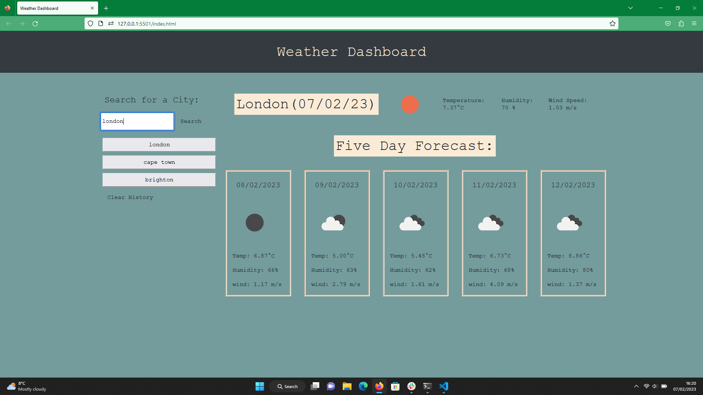

## Weather Dashboard

## Description

This weather dashboard retrieves server API data from the open weather map API, requesting specific data by creating URL's with specific parameters and then rendering this data dynamically to the HTML document. The project pulls data from both the daily and 5 day forecasts to present the user with weather over both periods. The user can search for weather data for specific cities and also retrieve data by clicking on dynamically rendered buttons linked to the users city search history which has been saved in local storage. This server side API project was built using HTML, Javascript, Jquery and CSS, as well as the jquery 3rd party API moment. 

In creating the project I wanted to learn and execute the building of functional web app that pulls specific data from a third party API and renders this to a webpage dynamically. I wanted the app to be useful and well designed. Undertaking this project further enhanced my front-end skills, by allowing me to successfully render 3rd party API data to a webpage and utilising javascript/jquery logic, as well as design in CSS/bootstrap, to the create a useable and functional application. The project also allowed me to learn and showcase JSON skills by saving and rendering data strings/arrays to and from local storage. I also implemented AJAX as a method to request, pull and render data from a third party API.

## Installation

N/A.

## Usage

The deployed site has an intuitive design, with the user simply searching for weather data in their desired location using the search bar. These searches will appear as buttons below the search bar and will render the data for these locations to the page on click. Users can also click to delete the search history via the 'clear history' button.

## Credits

N/A.

## License

please see license file in main branch of gitHub repository.

## Features

* Search for weather data for a specific city using the search bar by creating URL's
* Daily weather forecast data from search is pulled from open weather 3rd party API and rendered to page using AJAX and Jquery
* Five day weather forecast data from search is pulled from open weather 3rd party API and rendered to page using AJAX and Jquery
* Previous search history is rendered to local storage then onto the page as buttons
* When a user click on a city in the search history they are again presented with current and future conditions for that city
* Search history can be deleted from the page and local storage cleared on click of clear history button.

## Deployed Site

https://jamesrobertsutcliffe.github.io/weather-dashboard/

